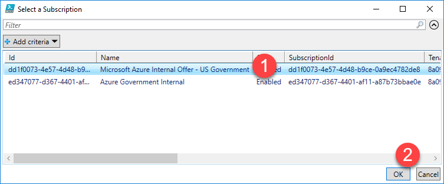
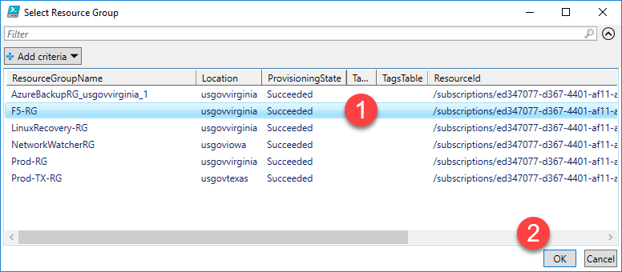
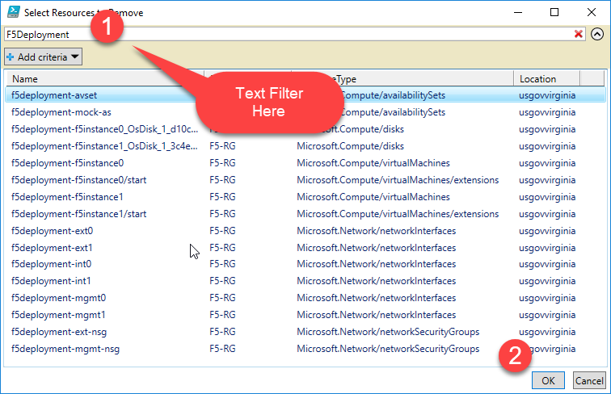
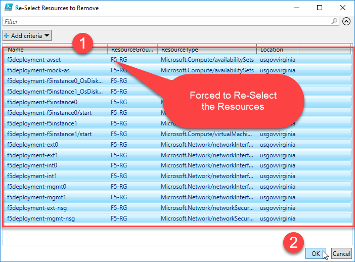
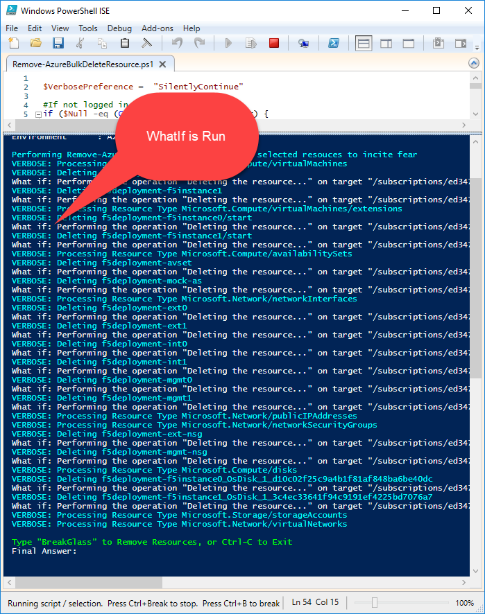
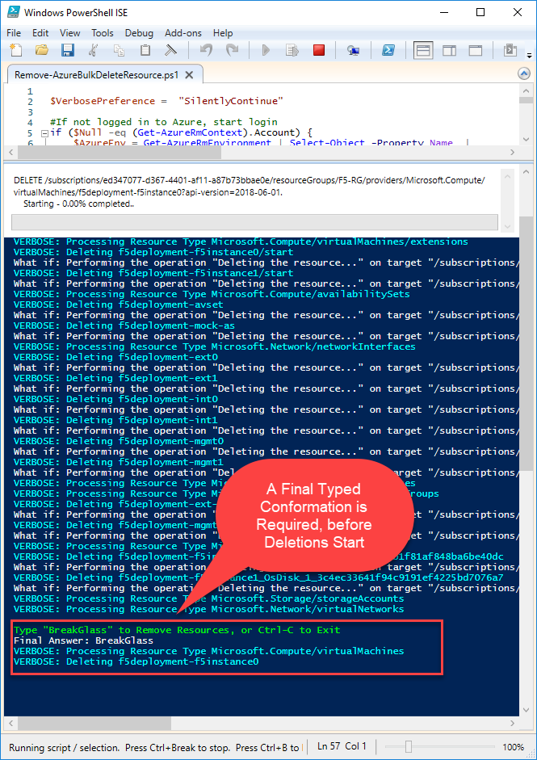

Azure Bulk Delete
=================

Introduction
------------

**This is a powerful and useful script that must be used with caution**!

The **Remove-AzureBulkDeleteResource.ps1** script vastly accelerates removing large
number of Azure resources in an unattended manner. Its primary use case is when
a large ARM deployment template is being tested and many resources must be
added/removed repeatedly. It can also be helpful to fully remove a single VM,
which often is tedious. It's difficult and time consuming, and sometime
completely impractical to remove resources by hand.

Safety Features
---------------

-   Before resources are removed, users are:

    -   Prompted 3 times: 2 with mouse clicks to confirm selection, and once by
        typing to confirm that they really want to remove the resources

    -   Shown a "- WhatIf" output of what will happen before it’s executed

-   Users are narrowed to resources within a singe Subscription and Resource
    Group

Important Features
------------------

-   Resources are removed in an order that allows us to accommodate common
    dependencies that make this operation hard do manually. For example, you can't delete
    a VM’s disk & NIC, until the parent VM Resource has been removed.

-   The script relies heavily on PowerShell Out-GridView. Out-GridView has some
    powerful filtering capabilities that are very helpful.

Walkthrough
-----------

1.  Open Script in Admin ISE or VS Code i.e. do not run from PowerShell command
    line

2.  Run the script

3.  Starts a logon to Azure, if you are not logged in

4.  Asks user to pick subscription

5.  Asks user to select Target Resource Group

6.  User filters/selects Target Resource for Removal

7.  Scripts presents the selection again for double verification

8.  A -WhatIf scenario is performed on the target resources

9.  Script prompts for a typed response to proceed with removed

10.  Items are removed based on a defined 'order of operations'

Known Issues
------------

The script uses an array of Resource names to dictate the order resources are
removed. We may need to add resources to this list as time passes to properly
handle the order of operations on deletions.
